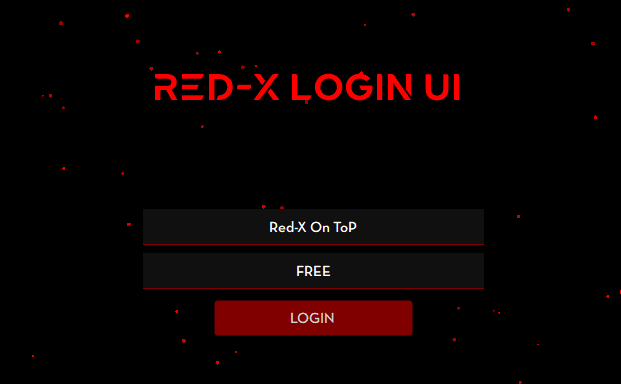

# 🔴 RED-X Login UI (C# WinForms)

  

A modern, animated C# WinForms login interface built for RED-X LITE, featuring particle effects, custom fonts, smooth animations.  
Designed using Guna UI2 for a clean and professional appearance.

---

## ✨ Features

- Modern UI using Guna.UI2.WinForms
- Animated particle background
- Custom embedded fonts
- Smooth fade-in and move animations
- Auto-save username and password
- Double-buffered rendering for smooth visuals
- Dark red themed cyber-style design

---

## 🧠 Technologies Used

- C# (.NET WinForms)
- Guna.UI2.WinForms
- Embedded custom fonts
- GDI+ rendering
- Timer-based animations

---

## 🛠️ Requirements

- Visual Studio 2019 or newer
- .NET Framework compatible with WinForms
- Guna.UI2.WinForms library

---

## 👑 Made with 🤍 by
Mohtasim Billah Jitu  
Founder – RED-X CORPORATION

---

